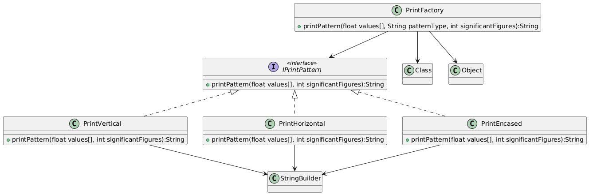

# FactoryMethod-DCC078-2026-3-A

## Tema: Printer

Um sitema fictício que lida com conjuntos numéricos (pra algum propósito fictício) no qual existam várias possibilidades de métodos de impressão, como por exemplo impressão em lista vertical, horizontal, matriz, etc.

Ao invés de criar um super-método que lide com cada diferente tipo de elemento, cria-se uma classe pra cada estrutura e delega a elas a função de impressão no formato correto, assim não é necessário/possível alteração (acidental ou não) de código referente à outra estrutura de dados.

O uso de FactoryMethod entra na instanciação de novos objetos, assim todos tipos diferentes podem ser criados com a alteração de apenas um parâmetro.

## Diagrama de Classes

